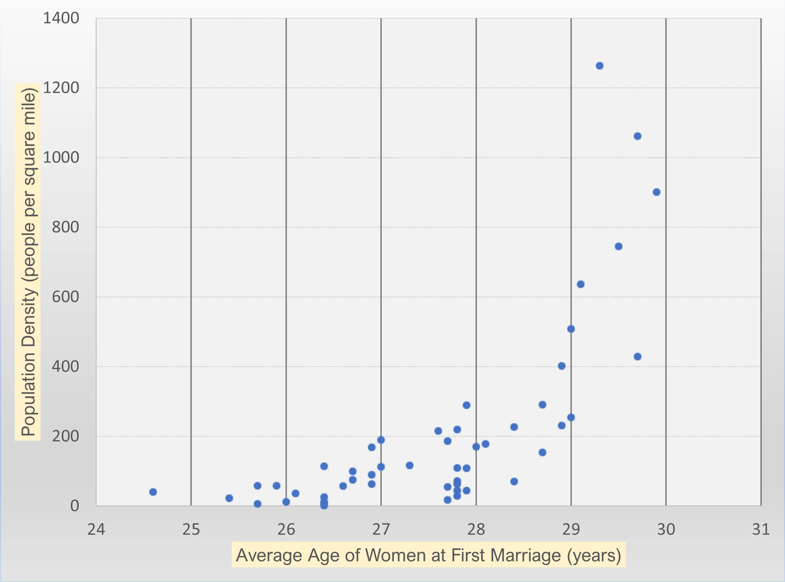
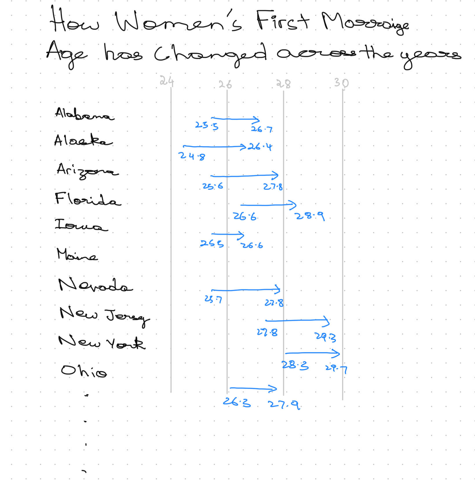

| [home page](https://cmustudent.github.io/tswd-portfolio-templates/) | [data viz examples](dataviz-examples) | [critique by design](critique-by-design) | [final project I](final-project-part-one) | [final project II](final-project-part-two) | [final project III](final-project-part-three) |

# Love Can Wait: How Women’s First Marriage Age Has Increased from 2006 to 2019
Redesigning Data Visualization: Median Age at First Marriage

## Step One: The Visualization

### **Original Visualization**

The original visualization was a scatter plot showing the relationship between **median age at first marriage** and **population density per square mile** across U.S. states. I selected this visualization because it aimed to uncover a potential correlation between urbanization and marriage trends, which is a valuable insight for policymakers, researchers, and sociologists. However, the scatter plot had **several weaknesses** that needed improvement.

## Step Two: The Critique

Using **Stephen Few's Data Visualization Effectiveness Profile**, I evaluated the original scatter plot and identified several strengths and weaknesses:

### **Effectiveness Scale Ratings**

| Criteria            | 1 | 2 | 3 | 4 | 5 | 6 | 7 | 8 | 9 | 10 |
|---------------------|---|---|---|---|---|---|---|---|---|----|
| **Usefulness**      |   |   |   |   |   |   | ✅ |   |   |    |
| **Completeness**    |   |   |   |   |   | ✅ |   |   |   |    |
| **Perceptibility**  |   |   |   |   | ✅ |   |   |   |   |    |
| **Truthfulness**    |   |   |   |   |   |   |   | ✅ |   |    |
| **Intuitiveness**   |   |   |   |   | ✅ |   |   |   |   |    |
| **Aesthetics**      |   |   |   | ✅ |   |   |   |   |   |    |
| **Engagement**      |   |   |   | ✅ |   |   |   |   |   |    |

### **Key Takeaways from the Critique**

✅ **What Worked Well:**
- **Appropriate Visualization Type** – A scatter plot is suitable for showing relationships between continuous variables.
- **Truthfulness** – Data was accurately represented without manipulation.
- **Adequate Axis Labeling** – Both axes clearly defined the variables.

❌ **What Didn’t Work Well:**
- **No Trend Line** – Hard to interpret correlation without a guiding line.
- **Poor Label Readability** – Yellow background on axis labels made text difficult to read.
- **Lack of Context** – No geographic context (e.g., state-wise identification).
- **No Call to Action** – The graph didn't explain why this data mattered.
- **Missing Title** – The audience had no immediate understanding of what the visualization was about.

Based on these insights, I planned to **redesign the visualization** to provide better clarity, engagement, and usability.

## Step Three: Sketch a Solution

### **Redesign Plan:**
I created **two types of sketches** for the redesign:

1. **Choropleth Maps** – Two separate maps displaying **median ages across states**, one for **2006–2010** and another for **2015–2019**, to clearly show state-wise distribution.
2. **Arrow Plots** – A visual representation of how the median age changed between the two time periods across states, using arrows to indicate the shift in values.

These two approaches allow for **both geographical comparison and a clear visual representation of changes over time.** 

By using:
- **Choropleth maps**, viewers can easily compare **regional differences** in first marriage age for women across two different time periods.
- **Arrow plots**, they can quickly identify states where marriage age has increased or decreased, with the **length and direction of arrows** signifying the degree of change.

This redesign approach enhances both **clarity and engagement**, ensuring that policymakers, researchers, and the general public can grasp the key insights **at a glance**.

### **Sketch 1**

.png) .png)

### **Sketch 2**

## Step Four: Test the Solution

### **User Feedback & Testing**

I conducted **three user interviews** to gather feedback on the redesigned sketches. The goal was to assess if the new visualization was easier to understand and more engaging.

#### **Interview Questions & Results**

| Question | Interview 1 | Interview 2 | Interview 3 |
|----------|-------------|-------------|-------------|
| What does Sketch 1 tell you? | "Shows geographical differences in marriage age." | "State-wise breakdown of first marriage ages." | "Easy to see which states have younger or older averages." |
| Is there anything you find confusing or unclear in Sketch 1? | "No immediate comparison between time periods." | "Would be better if differences were highlighted more." | "Some states have very similar colors, making differences harder to notice." |
| What does Sketch 2 tell you? | "Shows how marriage age has changed over time for each state." | "Clear comparison between time periods." | "Gives a strong visual representation of increasing trends." |
| Is there anything you find confusing or unclear in Sketch 2? | "Arrows make it look a little complex." | "Might be hard to compare for states with smaller changes." | "Spacing could be improved for readability." |
| Out of the two sketches, which one do you prefer? | "Sketch 2 (Arrow Plot) – It better represents change over time." | "Sketch 2 – Easier to understand the trend." | "Sketch 1 – Prefer geographical context over numeric change." |
| Is there anything you would change in either of the sketches? | "Add labels for states with significant changes." | "Consider color coding regions or trends for clarity." | "Remove arrows in Sketch 2 and use dots instead to make a range plot." |

#### **Synthesis of Feedback**

- **2 out of 3 users preferred the Arrow Plot (Sketch 2)** for effectively showing the change in marriage age over time.
- **1 user preferred the Choropleth Map (Sketch 1)**, finding it easier for geographical comparisons.
- **All participants agreed** that if the goal is to showcase **differences in values**, the **Arrow Plot (or an alternative range-based design) is better**.
- **One user suggested removing arrows** and instead using **only dots** to create a **range plot**, making it easier to interpret.
- **Additional clarity needed in Sketch 1** – Some states had very close values, making differences harder to spot.

This feedback led to the final decision of converting **Sketch 2 into a range plot by replacing arrows with dots** for a **cleaner and more interpretable visualization** while keeping **Sketch 1 as a supplementary geographical reference**.

## Step Five: Build the Solution

### **Final Visualization:**

[Insert final bubble chart visualization]

### **Key Changes in the Final Design:**
1. **Bubble Chart Instead of Scatter Plot** – To **distinguish states clearly** while keeping correlation insights.
2. **Trend Line Added** – To confirm the positive correlation.
3. **Readable Labels** – Removed yellow background, improved contrast.
4. **Annotated Key States** – Highlighted outliers for better interpretation.
5. **Color Gradient for Better Differentiation** – Made bubbles visually distinct.

### **Final Thoughts on the Process**
This redesign process **significantly improved** the readability and usability of the visualization. The **Stephen Few critique method was useful for technical evaluation**, but it lacked a storytelling component, which became clear during user interviews. The redesigned visualization now serves **a broader audience** by making insights more apparent and engaging.

## References
- Data source: [Insert link or citation]
- Original visualization: [Insert source]
- Few, S. (2017). *Data Visualization Effectiveness Profile.* Perceptual Edge.

## AI Acknowledgements
AI assistance was used to structure the critique, generate code for visualization, and refine user feedback synthesis. The final narrative was manually edited and tailored based on insights from testing and critique.
