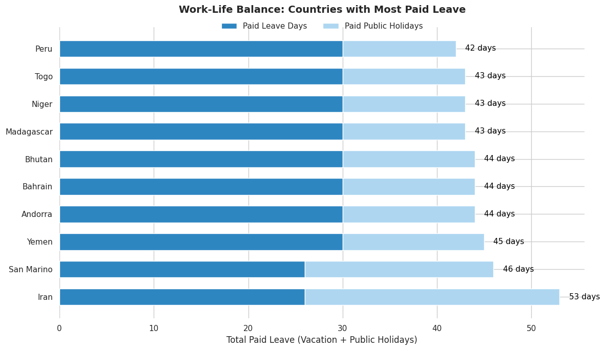

| [home page](https://aritra1804.github.io/aritra-dataviz-portfolio/) | [data viz examples](dataviz-examples) | [critique by design](critique-by-design) | [final project I](final-project-part-one) | [final project II](final-project-part-two) | [final project III](final-project-part-three) |

# Data visualization examples
_Below are some examples of visualizations I created during the course. Feel free to explore them._

## Trust in news organizations Visualization

👉 [Click here to view the full interactive Tableau Dashboard](https://public.tableau.com/app/profile/aritra.dutta6632/viz/TrustinNewsOrganizations_17380089848370/BarChart?publish=yes)

## 📊 Government Debt Tableau Visualization

👉 [Click here to view the full interactive Government Debt Dashboard](https://public.tableau.com/app/profile/aritra.dutta6632/viz/GovernmentDebt_17379191079810/Sheet1?publish=yes)

## 📊 Debt-to-GDP Ratio Trends in European Countries Tableau Visualization

👉 [Click here to view the full interactive Debt-to-GDP Ratio Trends Dashboard](https://public.tableau.com/app/profile/aritra.dutta6632/viz/Debt-to-GDPRatiotrendsinEuropeancountriesovertwodecades/Sheet1?publish=yes)

## 🌍 Work-Life Balance: Countries with Most Paid Leave

[
