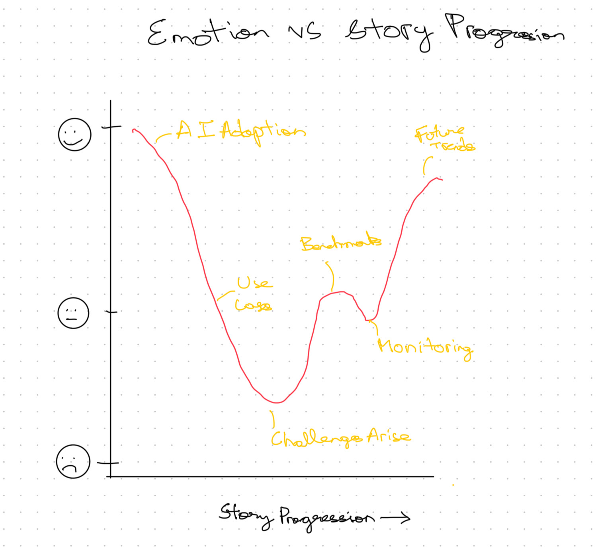
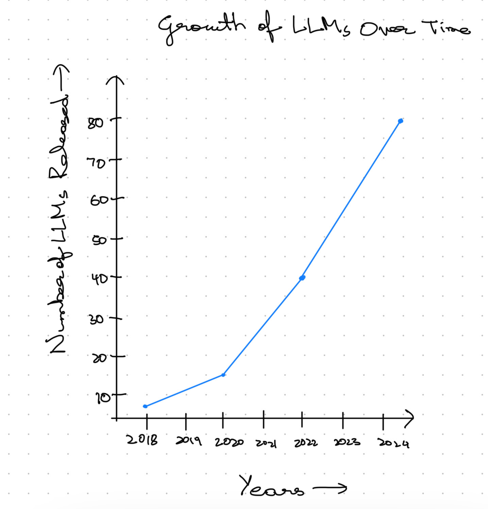
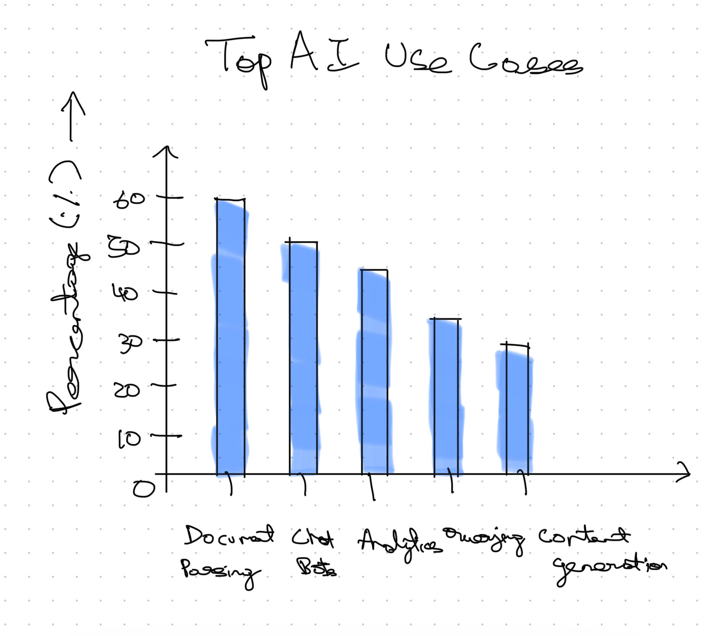
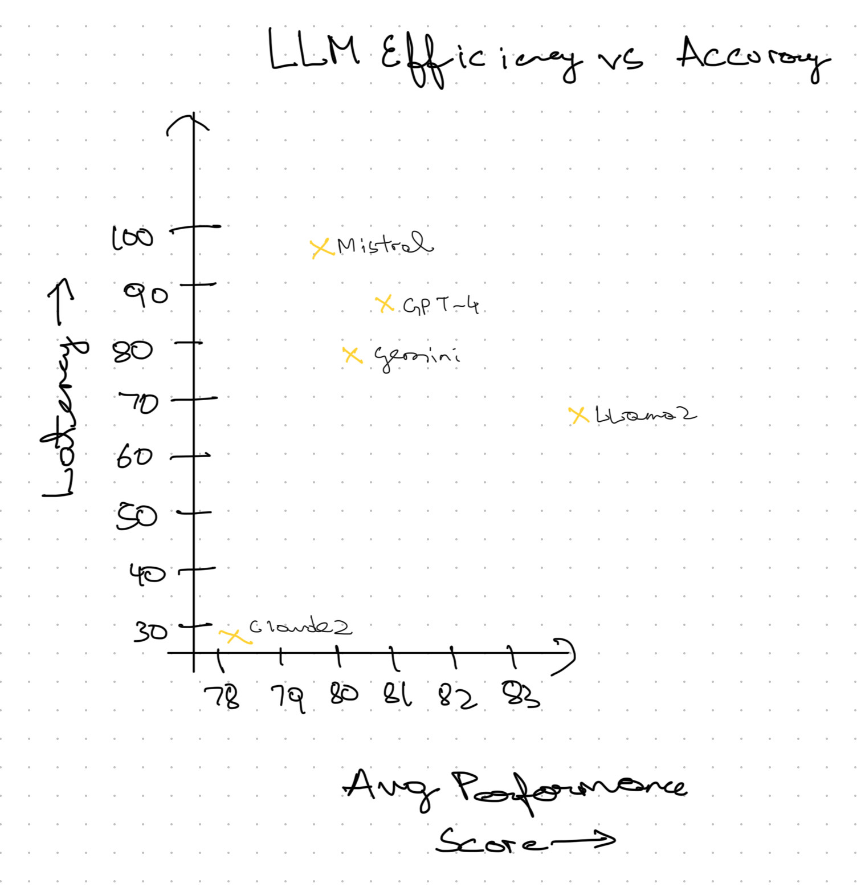

| [home page](https://cmustudent.github.io/tswd-portfolio-templates/) | [data viz examples](dataviz-examples) | [critique by design](critique-by-design) | [final project I](final-project-part-one) | [final project II](final-project-part-two) | [final project III](final-project-part-three) |

# **Is AI Inevitable for Business?**

## **Outline**

### **High-Level Summary**
AI is no longer a futuristic concept, rather it is a key driver of business transformation. From **automating tasks** to **enhancing customer interactions**, AI is increasingly integrated into business operations. However, **adoption remains polarized** as companies struggle with **deployment, security risks, and technical expertise gaps**.

This project presents a **data-driven narrative** on AI’s **adoption, infrastructure, and challenges**, supported by **real-world industry reports and benchmarks**. Through interactive **visual storytelling**, we will explore **how businesses are using AI, where AI is hosted, who is developing AI, and what challenges remain**.

The goal is to provide **business leaders, policymakers, and developers** with actionable insights into **AI’s present impact and its trajectory for the future**. 

---

## **Project Structure**

### **1. AI Model Releases Over Time**

- AI development is accelerating, with an increasing number of models being released each year (**Vellum AI, 2025**).

**Summary:** This section highlights the exponential growth of AI model development. Policymakers can track AI’s regulatory needs (**CRFM, n.d.**), business leaders can anticipate upcoming innovations, and developers can identify trends in model evolution.

### **2. The AI Adoption Surge**

- AI is no longer experimental—25.1% of businesses have deployed AI (**Vellum AI, 2025**).
- But adoption is polarized**—another 25.1% are still developing their strategy (**Vellum AI, 2024a**).

**Summary:** This section explores how AI is being adopted across industries. Policymakers can shape regulations, businesses can assess their competitive stance (**Statista, 2024**), and developers can find areas where AI expertise is in demand.

### **3. What Are Companies Using AI For?**

- AI is mostly used for document parsing (59.7%), chatbots (51.4%), and natural language analytics (43.8%) (**Vellum AI, 2024b**).

**Summary:** AI is streamlining operations and improving efficiency (**Qlik, 2024**). Tech professionals can explore high-demand AI applications, businesses can evaluate AI’s operational impact, and consumers can understand how AI influences their experiences.

### **4. Where Is AI Hosted?**

- 63.3% of companies use OpenAI’s cloud, followed by Azure (33.8%) and Anthropic (32.3%) (**Vellum AI, 2025**).

**Summary:** AI hosting has major implications for data privacy, security, and sovereignty (**CRFM, n.d.**). Policymakers can evaluate risks, businesses can assess vendor lock-in concerns, and developers can explore new hosting architectures.

### **5. Where Is AI Developed?**

- 52.2% of companies build AI internally, while 29.9% use third-party platforms (**Vellum AI, 2024b**).

**Summary:** AI development approaches affect innovation speed and security. Policymakers can oversee data protection in AI models (**BRACAI, n.d.**), businesses can determine whether in-house development is feasible, and developers can assess career opportunities in AI engineering.

### **6. Challenges in AI Adoption**

- 57.1% struggle with hallucinations and prompt engineering (**Vellum AI, 2024a**).
- 38.3% cite a lack of technical expertise as a major barrier (**Tsang, 2023**).

**Summary:** This section identifies key obstacles to AI scaling. Policymakers can explore solutions for responsible AI governance, business leaders can strategize for smoother AI integration, and developers can address limitations like bias and hallucinations (**CRFM, n.d.**).

### **7. Call to Action: The Role of Different Stakeholders in AI’s Future**

- Policymakers can develop AI governance frameworks that ensure fairness and transparency (**Vellum AI, 2025**).
- Businesses can invest in AI training and ethical AI deployment (**Qlik, 2024**).
- Developers can focus on improving AI reliability, fairness, and accessibility.
- Consumers can advocate for AI that aligns with their values and ethical considerations (**Statista, 2024**).

**Summary:** This section provides a roadmap for various stakeholders to shape AI’s future responsibly. Policymakers can enforce accountability, businesses can ensure fair AI usage, developers can enhance AI's trustworthiness, and users can engage critically with AI systems.

## Initial sketches
Initial skteches of my story:

1. User Emotion Chart

2. Growth of AI accross years

3. How is AI used?

4. How accurate is AI?

# The Data

## **Primary Data Sources**  
To ensure data-driven storytelling, this project will leverage:  
- **Hugging Face Open LLM Leaderboard** – Performance benchmarks for AI models.  
- **Stanford’s HELM Benchmark** – AI evaluation trends (**CRFM, n.d.**).  
- **State of AI Report 2024** – Insights on AI adoption, challenges, and infrastructure (**Vellum AI, 2025**).  
- **Industry Surveys (e.g., Vellum AI, Statista, Fireworks AI, Together AI)** – AI development trends and use cases (**Statista, 2024; Vellum AI, 2024a**).  
- **Academic Research (e.g., AI model fairness and efficiency studies)** – AI ethics and performance trade-offs (**Tsang, 2023; BRACAI, n.d.**).  
- **Corporate Reports (e.g., Qlik's AI Business Insights)** – AI’s impact on data analysis and automation (**Qlik, 2024**).  

## **Structured Data Sources**

| Name                          | URL                                                                                                       | Description                                              |
|-------------------------------|-----------------------------------------------------------------------------------------------------------|----------------------------------------------------------|
| **Hugging Face LLM Leaderboard** | [huggingface.co](https://huggingface.co)                                                                 | AI model performance comparison                          |
| **HELM Benchmark**            | [crfm.stanford.edu](https://crfm.stanford.edu)                                                           | AI evaluation framework (**CRFM, n.d.**)                 |
| **State of AI Report 2024**    | [vellum.ai](https://www.vellum.ai/state-of-ai-2025#10)                                                  | AI adoption and future trends (**Vellum AI, 2025**)      |
| **Vellum AI Leaderboard**      | [vellum.ai](https://www.vellum.ai/llm-leaderboard)                                                      | AI model ranking based on production use cases (**Vellum AI, 2024a**) |
| **Statista AI Adoption Report** | [statista.com](https://www.statista.com/statistics/1458141/leading-math-llm-tools/)                     | Business AI adoption trends (**Statista, 2024**)         |
| **AI Ethics & Model Fairness**  | [bracai.eu](https://www.bracai.eu/llm-eval)                                                             | AI bias, fairness, and efficiency evaluations (**BRACAI, n.d.**) |

## How the Data will be used? 

For the **AI Model Releases Over Time** section, I will use data from the **Vellum AI Report 2025** and **HELM Benchmark (CRFM, n.d.)** to track AI model growth and performance trends. 

For **The AI Adoption Surge**, data from **Vellum AI Report 2025, Vellum AI 2024a,** and **Statista AI Adoption Report 2024** will highlight AI deployment stages across industries, showing adoption progress and strategic developments.

For **What Are Companies Using AI For?**, I will analyze data from **Vellum AI 2024b** and **Qlik’s AI Business Insights (Qlik, 2024)** to explore key AI applications like document parsing, chatbots, and analytics.

For **Where Is AI Hosted?**, I will use data from the **Vellum AI Report 2025** and **HELM Benchmark (CRFM, n.d.)** to examine AI hosting trends, emphasizing cloud dominance and emerging alternatives.

For **Where Is AI Developed?**, data from **Vellum AI 2024b** and academic research (**Tsang, 2023; BRACAI, n.d.**) will compare in-house AI development with third-party platforms, assessing security and efficiency trade-offs.

For **Challenges in AI Adoption**, I will use **Vellum AI 2024a, academic research (Tsang, 2023),** and **HELM Benchmark (CRFM, n.d.)** to highlight key barriers, such as hallucinations, prompt engineering, and technical expertise gaps.

For **Call to Action: The Role of Different Stakeholders in AI’s Future**, insights from **Vellum AI Report 2025, Qlik’s AI Business Insights (Qlik, 2024),** and **Statista AI Adoption Report 2024** will outline responsibilities for policymakers, businesses, developers, and consumers in shaping AI’s future.

The dataset has been created by me, with all data extracted from the sources and reports mentioned above and compiled together. As the project progresses, I will continue to extract additional data based on the visualizations and evolving needs of the project. The structured dataset is available [here](https://docs.google.com/spreadsheets/d/1LvEh062qCGMBKL1x4O_KXjH7mzgktMrNjfiMy1GRnrA/edit?usp=sharing).  

# Method and medium
This project will be built using **interactive storytelling tools and data visualization platforms**:  
- **Shorthand** for digital storytelling.  
- **Tableau** for interactive data visualizations.  
- **GitHub Pages** for project hosting and documentation.  
- **HTML/CSS** for project styling.  

📌 **Final Deliverable:**  
An **interactive, stand-alone project** combining **Shorthand storytelling with data visualizations** to communicate insights effectively.  

## References

- BRACAI. (n.d.). *LLM evaluation*. Retrieved February 4, 2025, from [https://www.bracai.eu/llm-eval](https://www.bracai.eu/llm-eval)  

- CRFM. (n.d.). *The Stanford 2024 foundation model report*. Stanford University. Retrieved February 4, 2025, from [https://crfm.stanford.edu/report.html](https://crfm.stanford.edu/report.html)  

- Qlik. (2024). *After AI: Reinventing data, insights, and action amidst the noise*. Retrieved February 4, 2025, from [https://assets.qlik.com/image/upload/v1736282773/qlik/docs/resource-library/ebooks/resource-eb-after-ai-reinventing-data-insights-and-action-amidst-the-noise-en_lna7iz.pdf](https://assets.qlik.com/image/upload/v1736282773/qlik/docs/resource-library/ebooks/resource-eb-after-ai-reinventing-data-insights-and-action-amidst-the-noise-en_lna7iz.pdf)  

- Statista. (2024). *Leading math LLM tools worldwide in 2024*. Retrieved February 4, 2025, from [https://www.statista.com/statistics/1458141/leading-math-llm-tools/](https://www.statista.com/statistics/1458141/leading-math-llm-tools/)  

- Tsang, S. H. (2023, March 27). *Brief review: MMLU—Measuring massive multitask language understanding*. Medium. Retrieved February 4, 2025, from [https://sh-tsang.medium.com/brief-review-mmlu-measuring-massive-multitask-language-understanding-7b18e7cbbeab](https://sh-tsang.medium.com/brief-review-mmlu-measuring-massive-multitask-language-understanding-7b18e7cbbeab)  

- Vellum AI. (2024a, January 15). *LLM leaderboard*. Retrieved February 4, 2025, from [https://www.vellum.ai/llm-leaderboard](https://www.vellum.ai/llm-leaderboard)  

- Vellum AI. (2024b, February 1). *Must-know AI facts and statistics*. Retrieved February 4, 2025, from [https://www.vellum.ai/blog/must-know-ai-facts-and-statistics](https://www.vellum.ai/blog/must-know-ai-facts-and-statistics)  

- Vellum AI. (2024c, February 1). *How to evaluate the quality of large language models for production use cases*. Retrieved February 4, 2025, from [https://www.vellum.ai/blog/how-to-evaluate-the-quality-of-large-language-models-for-production-use-cases](https://www.vellum.ai/blog/how-to-evaluate-the-quality-of-large-language-models-for-production-use-cases)  

- Vellum AI. (2025). *State of AI 2025: 10 key trends shaping artificial intelligence*. Retrieved February 4, 2025, from [https://www.vellum.ai/state-of-ai-2025#10](https://www.vellum.ai/state-of-ai-2025#10)  

- OpenAI. (2023). *ChatGPT* [Large language model]. Retrieved February 4, 2025, from [https://chat.openai.com] (https://chat.openai.com)

## AI acknowledgements

For this assignment, I used ChatGPT to help refine my ideas and brainstorm narrative structures. Additionally, I utilized Grammarly to check the grammar of my writing as well as improve it.

